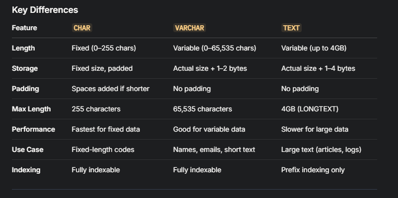

In MySQL, CHAR, VARCHAR, and TEXT are all data types used to store string data, but they differ in how they handle storage, length, and use cases. Here’s a detailed comparison:

## CHAR
- Definition: Fixed-length string data type.
- Length: 0 to 255 characters (specified as CHAR(n), where n is the fixed length).
- Storage: Always reserves the full specified length in bytes, padding with spaces if the data is shorter. For example, CHAR(10) always uses 10 bytes (or more, depending on character set like UTF-8).
- Performance: Faster for fixed-length data because the storage size is predictable, making it efficient for operations like indexing or comparisons.
- Use Case: Best for short, fixed-length data where consistency is key, e.g., country codes (US, CA), gender (M, F), or status flags (Y, N).
- Example:
```sql
CREATE TABLE example (code CHAR(2));
INSERT INTO example (code) VALUES ('US'); -- Stored as 'US' (2 bytes, no padding needed).
INSERT INTO example (code) VALUES ('A');  -- Stored as 'A ' (padded with a space).
```
## VARCHAR
- Definition: Variable-length string data type.
- Length: 0 to 65,535 characters (specified as VARCHAR(n), where n is the maximum length). Note: The actual limit depends on the row size (max 65,535 bytes) and character encoding.
- Storage: Stores only the actual data plus 1 or 2 bytes to record the length (1 byte if n ≤ 255, 2 bytes if n > 255). No padding is added.
- Performance: Slightly slower than CHAR for fixed-length data due to the overhead of tracking length, but more space-efficient for varying lengths.
- Use Case: Ideal for strings of varying length where the maximum size is known, e.g., names, email addresses, or short descriptions.
- Example:
```sql
CREATE TABLE example (name VARCHAR(50));
INSERT INTO example (name) VALUES ('John Doe'); -- Uses 8 bytes + 1 byte for length.
INSERT INTO example (name) VALUES ('Alice');   -- Uses 5 bytes + 1 byte for length.
```
## TEXT
- Definition: Variable-length string data type for large text data.
- Length: Comes in variants with different maximum sizes (in bytes):
  - TINYTEXT: 255 bytes (~255 characters with single-byte encoding).
  - TEXT: 65,535 bytes (~65K characters).
  - MEDIUMTEXT: 16,777,215 bytes (~16M characters).
  - LONGTEXT: 4,294,967,295 bytes (~4GB characters).
- Storage: Stores the actual data plus 1–4 bytes to record the length (depending on the variant). Data is often stored outside the main table row in a separate space, which can affect performance.
- Performance: Slower than CHAR or VARCHAR for small data due to overhead and potential disk I/O for large data. Not ideal for indexing (you’d need to use a prefix index).
- Use Case: Best for large, unstructured text like articles, comments, JSON blobs, or logs where the size is unpredictable or exceeds VARCHAR limits.
- Example:
```sql
CREATE TABLE example (description TEXT);
INSERT INTO example (description) VALUES ('A short description.');
INSERT INTO example (description) VALUES ('A very long article text... [thousands of characters]');
```



Practical Considerations
- Space Efficiency: Use CHAR for fixed-length data to avoid length overhead, VARCHAR for variable-length data with a known cap, and TEXT for large or unbounded text.
- Query Behavior: Trailing spaces in CHAR are ignored in comparisons (e.g., 'A ' = 'A'), but not in VARCHAR or TEXT.
- Character Encoding: The actual storage size depends on the encoding (e.g., UTF-8 uses 1–4 bytes per character), affecting the effective length limits.
